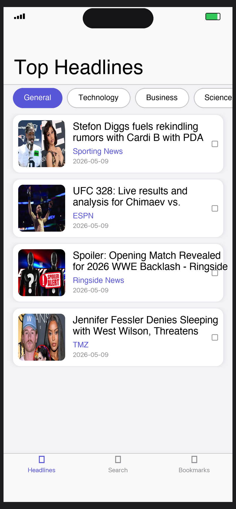
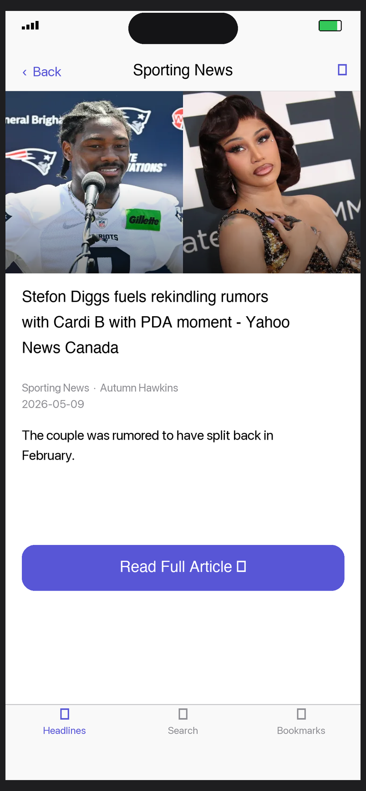
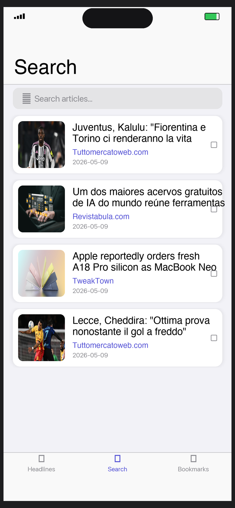
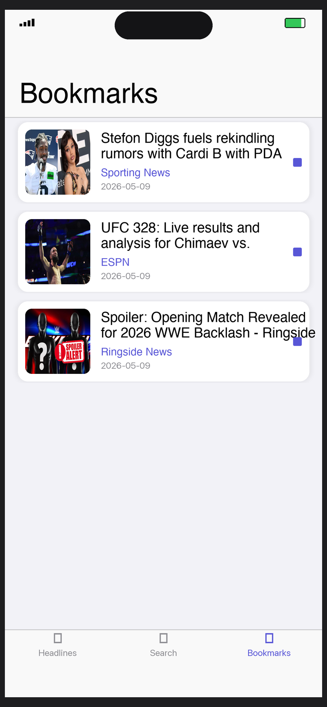

# NewsFlow

A fully programmatic iOS news reader app built with UIKit, Core Data, Core Animation, and the [NewsAPI](https://newsapi.org). No storyboards. No SwiftUI shortcuts.

---

## Screenshots

| Headlines | Article Detail | Search | Bookmarks |
|:---------:|:--------------:|:------:|:---------:|
|  |  |  |  |

---

## Features

- **Top Headlines** — browse news by category (General, Technology, Business, Science, Health, Sports, Entertainment)
- **Live Search** — debounced search with pagination across all sources
- **Bookmarks** — save articles offline with Core Data; swipe-to-delete
- **Article Detail** — full hero image, metadata, and one-tap read in Safari
- **Shimmer loading** — Core Animation gradient shimmer while content loads
- **Staggered cell animations** — spring-based reveal on every list load
- **Offline support** — bookmarked articles available without a connection

---

## Tech Stack

| Area | Implementation |
|------|---------------|
| Language | Swift 5.9 |
| UI Framework | UIKit (fully programmatic, zero storyboards) |
| Architecture | MVVM with closure-based bindings |
| Persistence | Core Data (`NSFetchRequest`, `NSPredicate`, `NSMergePolicy`) |
| Animations | Core Animation (`CAGradientLayer`, `CASpringAnimation`, `CAKeyframeAnimation`) |
| Networking | `URLSession` + `async/await` + `Codable` |
| API | [NewsAPI.org](https://newsapi.org) |
| Image loading | Custom async loader with `NSCache` |
| Minimum iOS | 16.0 |

---

## Project Structure

```
NewsFlow/
├── App/
│   ├── AppDelegate.swift
│   └── SceneDelegate.swift
├── Models/
│   └── Article.swift
├── Services/
│   └── NewsAPIService.swift          # URLSession + async/await REST layer
├── Persistence/
│   ├── CoreDataManager.swift         # CRUD singleton for bookmarks
│   └── NewsFlow.xcdatamodeld/
├── ViewModels/
│   ├── HeadlinesViewModel.swift
│   ├── SearchViewModel.swift
│   └── BookmarksViewModel.swift
├── Views/
│   ├── Controllers/
│   │   ├── MainTabBarController.swift
│   │   ├── HeadlinesViewController.swift
│   │   ├── ArticleDetailViewController.swift
│   │   ├── SearchViewController.swift
│   │   └── BookmarksViewController.swift
│   ├── Cells/
│   │   ├── ArticleTableViewCell.swift
│   │   └── CategoryCollectionViewCell.swift
│   └── Custom/
│       └── ShimmerView.swift         # Core Animation shimmer loader
└── Utilities/
    ├── Constants.swift
    └── Extensions.swift
```

---

## Getting Started

### Prerequisites
- Xcode 15+
- iOS 16+ simulator or device
- Free API key from [newsapi.org/register](https://newsapi.org/register)

### Setup

1. **Clone the repo**
   ```bash
   git clone https://github.com/AlfawakhryDev/NewsFlow.git
   cd NewsFlow
   ```

2. **Add your API key**

   Open `NewsFlow/Utilities/Constants.swift` and replace the placeholder:
   ```swift
   static let newsAPIKey = "YOUR_NEWS_API_KEY_HERE"
   ```

3. **Open in Xcode**
   ```bash
   open NewsFlow.xcodeproj
   ```

4. **Run** — select a simulator and hit `Cmd+R`

> **Regenerating the project** (if needed): install [xcodegen](https://github.com/yonaskolb/XcodeGen) and run `xcodegen generate` in the root directory.

---

## Architecture

The app follows **MVVM** with a simple closure-based binding pattern — no Combine, no third-party reactive libraries.

```
ViewController  →  calls  →  ViewModel
ViewModel       →  calls  →  Service / CoreDataManager
ViewModel       →  notifies via  →  onStateChange closure
ViewController  →  renders state  →  UIKit updates
```

Each ViewModel exposes a single `State` enum (`loading`, `loaded`, `error`) that the view controller switches on — keeping all business logic out of the view layer.

---

## Author

**Abdelrahman Alfawakhry** — [github.com/AlfawakhryDev](https://github.com/AlfawakhryDev)
